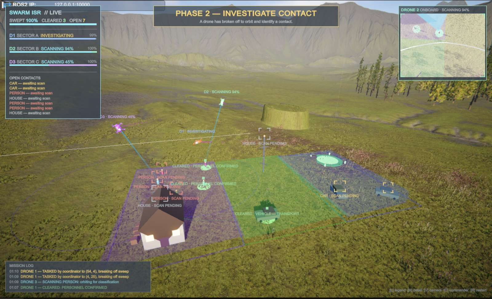
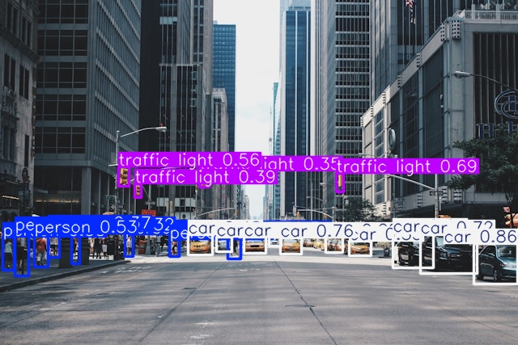

# Autonomous Multi-Agent Drone Swarm Simulation

Three drones autonomously search an area, spot what's in it, decide among themselves who investigates what, and report a verdict — a complete ISR loop running across Unity and ROS 2.

Unity simulates the drones, their onboard cameras and their sensor cones. ROS 2 carries every detection, position and order between them. The dispatch logic that decides which drone breaks off for which contact is pure Python, unit tested, and runs in its own container.



*Phase 2 mid-mission. Drone 3 is scanning a person at 45%, Drone 2 another at 94%, Drone 1 is en route to a third. Cleared contacts already carry green discs and their verdicts; the seven still open are listed top-left and bracketed in the world. The top-right panel is Drone 2's live onboard camera — the same frames published to ROS 2.*

---

## Features

- **Multi-agent swarm** — 3 ROS 2 drone nodes operating autonomously in parallel
- **Autonomous area search** — each drone flies a lawnmower sweep of its own sector, with lane spacing derived from its live sensor footprint so the sweep leaves no gaps
- **Simulated sensor model** — downward cone with field-of-view and line-of-sight occlusion tests, publishing detections in the same JSON shape real CV does
- **YOLOv8 object detection** — optional drop-in replacement for the simulated sensor, running on the live Unity camera feed
- **LLM mission planner** — Claude (Anthropic API) turns a clicked Commander-mode order into a structured flight plan
- **Distributed coordination** — detections are shared across drones, deduplicated, and dispatched to the closest available agent; an urgent contact preempts a drone busy with a lesser one
- **Live dashboard** — Streamlit web UI showing drone positions, detection log, and mission log in real time
- **FastAPI bridge** — exposes live swarm state as a REST API
- **Single command** — `docker compose up` starts every process; Unity self-wires on Play
- **Tested dispatch logic** — the task allocator is pure Python with a 31-case pytest suite, validated by mutation testing

---

## Defense Applications

- ISR (Intelligence, Surveillance, Reconnaissance) patrol automation
- Perimeter monitoring with autonomous threat detection
- Logistics resupply route optimization
- Multi-vehicle coordination for contested environments

---

## Architecture

```
        Unity (UAV-Swarm-Swim)                     Docker container (ROS 2 Humble)
 ┌─────────────────────────────────┐        ┌──────────────────────────────────────────┐
 │  DroneController ×3              │        │                                          │
 │   • flies to waypoints          │        │   swarm_coordinator                      │
 │   • publishes camera_frame ─────┼──┐     │    • dedupe + threat tier                │
 │   • publishes position ─────────┼──┼────▶│    • closest-drone dispatch              │
 │                                 │  │     │    • high-priority preemption            │
 │  DroneSensor ×3                 │  │     │    • /swarm/alerts, /swarm/status        │
 │   • FOV + line-of-sight check ──┼──┼────▶│         │            │                    │
 │   • publishes /drone_N/detections│  │     │         ▼            ▼                    │
 │                                 │  │     │   /drone_N/mission   swarm_api (:8000)   │
 │  SearchPattern ×3               │◀─┼─────┼─────────┘            │  FastAPI /state    │
 │   • lawnmower sweep when idle   │  │     │                      │                    │
 │  MissionHUD / MissionCamera     │  │     │                      │                    │
 │  CommanderMode  (press C) ──────┼──┼────▶│   mission_planner (Claude, on order)     │
 └─────────────────────────────────┘  │     └──────────────────────┼───────────────────┘
        ros_tcp_endpoint bridge ◀─────┘                            │
                                                                   ▼
                                                 dashboard.py (Streamlit, :8501)
```

Real CV (`real_detection.py`, YOLOv8 on `camera_frame`) is an optional drop-in
replacement for `DroneSensor` — same `/drone_N/detections` topic and JSON shape.
Nothing downstream can tell the difference, which is the point of keeping the
contract between them to one message type.



---

## Tech Stack

| Layer | Technology |
|---|---|
| Robotics middleware | ROS 2 Humble |
| Simulation | Docker (Ubuntu 22.04 ARM64) |
| Object detection | YOLOv8 (Ultralytics), plus a simulated sensor model |
| Mission planning | Anthropic API (Claude) |
| Task allocation | Greedy nearest-available dispatch with priority preemption |
| API bridge | FastAPI + Uvicorn |
| Dashboard | Streamlit + Plotly |
| 3D visualization | Unity 6.3 URP + C# |
| Language | Python 3.13, C# |
| Container | Docker |

---

## Getting Started

### Prerequisites
- Docker Desktop
- Python 3.x
- Unity 6.3 LTS
- Anthropic API key

### Run the swarm

**1. One command, one terminal:**
```bash
docker compose up --build
```
That builds the image (ROS 2 Humble, the `ros_tcp_endpoint` package, and the Python
dependencies in `docker/requirements.txt`) and starts every process in one container:
the three drone agents, the coordinator, the mission planner, the FastAPI bridge,
the Unity ROS-TCP endpoint, and the Streamlit dashboard. `--build` is only needed
the first time and whenever `Dockerfile` / `docker/requirements.txt` change — the
repo is bind-mounted, so Python edits just need a restart.

**2. Open the dashboard:** <http://localhost:8501>

**3. Open Unity and press Play.**

Everything wires itself at runtime (`SwarmBootstrap`): the drones get numbered and
given sensors, search patterns, scan behaviour and coverage maps, and the mission
HUD and director camera are created. There is nothing to set up in the Inspector.

> `ANTHROPIC_API_KEY` is read from your shell or a `.env` file in this directory.
> It is only used for Commander mode's LLM planning — the stack runs fine without it.

<details>
<summary>Running the pieces separately</summary>

`launch_swarm.py` takes `--no-bridge` and `--no-dashboard` if you'd rather run
those yourself — e.g. to run the dashboard on the host against the host `venv`:

```bash
docker compose run --rm --service-ports swarm python3 launch_swarm.py --no-dashboard
# then, on the host:
source venv/bin/activate && streamlit run dashboard.py
```

For an interactive container shell: `docker compose run --rm swarm bash`.
To run real YOLOv8 instead of Unity's simulated sensor:
`python3 swarm/real_detection.py` inside the container.
</details>

---

## Project Structure

```
Drone_Simulator/
├── swarm/              # ROS 2 nodes (run inside the Docker container)
│   ├── task_allocation.py   # pure-Python dispatch logic (unit tested)
│   ├── swarm_coordinator.py # thin ROS adapter over task_allocation
│   ├── drone_agent.py       # per-drone ROS presence (logs assigned missions)
│   ├── real_detection.py    # optional: real YOLOv8 on the live camera feed
│   ├── mission_planner.py   # Commander-mode orders -> flight plan (Claude)
│   └── swarm_api.py         # FastAPI service exposing live swarm state (:8000)
├── tests/               # pytest suite for the allocation logic
├── gazebo/              # Gazebo world (SDF) — physics integration, in progress
├── models/               # YOLO model weights (gitignored, auto-downloaded)
├── requirements-dev.txt  # pytest
├── assets/               # demo images
├── docker-compose.yml    # one command runs the whole stack
├── launch_swarm.py       # starts every node, the Unity bridge and the dashboard
├── dashboard.py          # Streamlit live dashboard (:8501, runs in-container)
├── Dockerfile             # reproducible ROS 2 + YOLO + swarm container
├── docker/requirements.txt # Python deps installed inside the container
├── requirements.txt       # host-side deps, only if running the dashboard locally
├── UAV-Swarm-Swim/       # Unity project (own git repo/remote)
│   └── Assets/
│       ├── Scripts/
│       │   ├── SwarmBootstrap.cs    # wires the whole scene at Play time
│       │   ├── DroneController.cs   # flight, onboard camera, ROS position/frames
│       │   ├── DroneSensor.cs       # downward sensor cone, FOV + occlusion test
│       │   ├── SearchPattern.cs     # lawnmower sweep of an assigned sector
│       │   ├── TargetScan.cs        # orbit + scan + classify (the mission payoff)
│       │   ├── SectorCoverage.cs    # live painted coverage map per sector
│       │   ├── SearchVisualizer.cs  # sector bounds, route, sensor footprint
│       │   ├── MissionDirector.cs   # mission phases + event log
│       │   ├── MissionHUD.cs        # ground-control overlay, onboard feed
│       │   ├── MissionCamera.cs     # director camera
│       │   ├── ScenarioSpawner.cs   # builds the scenario from primitives
│       │   ├── Pedestrian.cs        # wandering contacts
│       │   └── CommanderMode.cs     # press C to click-order a drone
│       └── Editor/                  # "Swarm → Setup Scene" one-click wiring
├── ros2_ws/              # ROS 2 workspace (colcon build)
└── venv/                 # Python virtualenv (gitignored)
```

---

## What you're looking at

### Reading the screen

| Where | What it is |
|---|---|
| Top left | Area swept, contacts cleared, contacts still open. Then one row per drone: its sector, what it's doing right now, and its sector coverage bar. Below that, every contact still awaiting a scan. |
| Top centre | The mission phase, and one line explaining it. |
| Top right | The live onboard camera of whichever drone matters right now. |
| Bottom left | The mission log — every tasking, scan and verdict, newest first. |
| Bottom right | The legend during the briefing, then the key bindings. |
| In the world | Coloured boxes are sector boundaries. A ring under a drone is its sensor footprint. Shaded ground has been searched. A pulsing bracket is a contact awaiting a scan; a green disc is one already cleared. |

### The loop

The scene runs a full ISR loop. Watching it, in order:

1. **Briefing** — the objective banner names the task. The search area is one
   60 × 30 rectangle split into three equal strips, outlined on the ground in
   each drone's colour:

   ```
   z=30 +--------------+--------------+--------------+
        |   SECTOR A   |   SECTOR B   |   SECTOR C   |
        |    Drone 1   |    Drone 2   |    Drone 3   |
    z=0 +--------------+--------------+--------------+
       x=0            x=20           x=40           x=60
   ```

2. **Area search** — each drone flies a lawnmower sweep of its own sector. The
   dim line is its planned route, the bright line is the leg it's currently
   flying, and the ring underneath is its live sensor footprint. Ground it has
   swept fills in behind it, and the HUD counts up **AREA SWEPT %**. Lane spacing
   is derived from the sensor footprint at runtime, so the sweep always overlaps
   just enough to leave no gaps.
3. **Contact** — when a target enters a drone's sensor cone (and isn't occluded),
   it's published to ROS 2 as a detection. A lock-on bracket appears and the
   mission log calls it out.
4. **Tasking** — `swarm_coordinator` scores every drone and assigns the closest
   available one. A `person` outranks a vehicle, and will **preempt** a drone
   already investigating something lower-priority.
5. **Collection** — the tasked drone breaks off, orbits the contact and runs a
   timed scan, projecting a sensor beam and sweeping a ground ring.
6. **Cleared** — the contact is classified, flashes its result colour once, then
   goes dark and gets a permanent **green disc** on the ground. Its lock-on
   bracket collapses to a small tick and it drops off the open-contacts list. The
   verdict goes back over ROS 2 to the coordinator (freeing the drone) and to the
   Streamlit dashboard.
7. **Area clear** — once every sector is swept and every contact cleared, the
   objective completes.

The screen gets *quieter* as the mission progresses: anything still pulsing is
work the swarm still owes.

| Key | Action |
|---|---|
| `H` | cycle HUD detail — Full → Minimal → Off |
| `L` | toggle the legend (shows itself during the briefing) |
| `V` | toggle director camera ↔ free camera |
| `1` `2` `3` | free camera only — jump to that drone |
| `0` | free camera only — back to the overview |
| `W` `A` `S` `D` `Q` `E` | free camera only — fly it yourself (hold `Shift` for speed) |
| `R` | restart the mission — resets Unity *and* the ROS 2 side |
| `C` | Commander mode — click the terrain to task a drone manually |

`V` hands control over, it does not move the camera. To follow one drone, press
`V` and then `1`, `2` or `3`.

`R` publishes to `/swarm/reset`, which `swarm_coordinator` and `swarm_api` both
subscribe to: the coordinator drops its targets, assignments and resolve
cooldowns, and the API clears the dashboard's history. Unity tears down the
scenario *before* signalling and waits for the reset to land before respawning,
so no detection from the old run can leak into the new one.

The camera directs itself: it holds a high orbit of the search area, chases a
drone that breaks off, swings around the contact being scanned, then settles over
the base for recovery. The top-right panel is the **live onboard feed** of
whichever drone matters right now — the same `RenderTexture` that gets encoded
and published to ROS 2 as `/drone_N/camera_frame`.

When the objective completes, the drones return to base and an **after-action
summary** reports mission time, area swept, contacts by type, average
detect-to-verdict latency, and how many each drone closed out.

---

## Tests

The dispatch logic — who gets sent where, and when an urgent contact preempts a
drone already busy with a lesser one — lives in `swarm/task_allocation.py`, which
has no ROS, Unity or Docker dependencies. Time is injected rather than read from
the clock, so cooldown and timeout behaviour is deterministic.

```bash
pip install -r requirements-dev.txt
pytest
```

31 tests cover assignment, priority preemption and requeueing, deduplication
across drones, alert escalation, scan resolution, cooldown expiry and
investigation timeouts. The suite was checked by mutation testing — deliberately
breaking each rule in turn and confirming a test fails. That caught one test that
passed only because a *different* code path happened to produce the same result.

---

## Roadmap

- [x] Multi-agent ROS 2 swarm
- [x] Task allocation with priority preemption
- [x] YOLOv8 real-time object detection
- [x] LLM mission planner (Commander mode)
- [x] Distributed swarm coordination
- [x] Live Streamlit dashboard
- [x] Unity 3D visualization with per-drone camera feeds
- [x] Simulated sensor model + autonomous area search (lawnmower sweep)
- [x] Threat classification and high-priority alert escalation
- [x] Mission reset across both Unity and ROS 2
- [ ] Gazebo physics integration (`gazebo/drone_world.sdf` started)
- [ ] Obstacle-aware routing — drones currently fly direct to waypoints
- [ ] Reinforcement learning for adaptive patrol routes

---

## Author

William Homan — CS Student @ University of Georgia | AI/Automation Engineer Intern Currently


Built to demonstrate autonomous systems, multi-agent AI coordination, and defense-relevant simulation — targeting roles at companies like Anduril, Shield AI, and L3Harris.